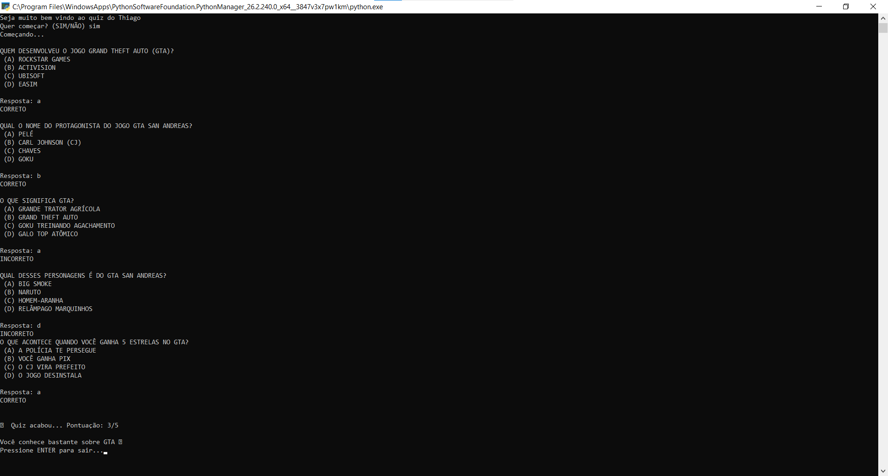

# 🎮 Quiz em Python

Projeto simples de quiz desenvolvido em Python no terminal.

O sistema contém perguntas sobre o universo GTA, utilizando alternativas divertidas e mostrando a pontuação final do jogador ao término do jogo.

---

## 🚀 Tecnologias Utilizadas

- Python
- PyCharm
- Git
- GitHub

---

## 📚 Conceitos Praticados

- Variáveis
- Condições (`if` e `else`)
- Entrada de dados com `input`
- Sistema de pontuação
- f-string
- Estruturas básicas em Python
- Tratamento de entrada com `.upper()`

---

## ▶️ Como Executar o Projeto

1. Instale o Python em seu computador
2. Faça o download ou clone este repositório
3. Execute o arquivo principal:

```bash
python quiz.py
```

---

## 📷 Demonstração



---

## 🎯 Funcionalidades

- Quiz interativo no terminal
- Perguntas com múltiplas alternativas
- Sistema de pontuação
- Validação de respostas
- Mensagem personalizada de desempenho ao final do jogo
- Interface simples e divertida

---

## 💡 Objetivo do Projeto

Este projeto foi desenvolvido com o objetivo de praticar lógica de programação e os conceitos iniciais da linguagem Python de forma divertida e interativa.

---

## 🚀 Melhorias Futuras

- Adicionar mais perguntas
- Criar sistema de ranking
- Implementar níveis de dificuldade
- Adicionar cronômetro
- Utilizar listas e funções para otimizar o código

---

## 👨‍💻 Autor

Thiago Messias